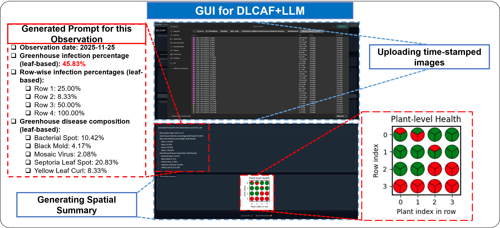
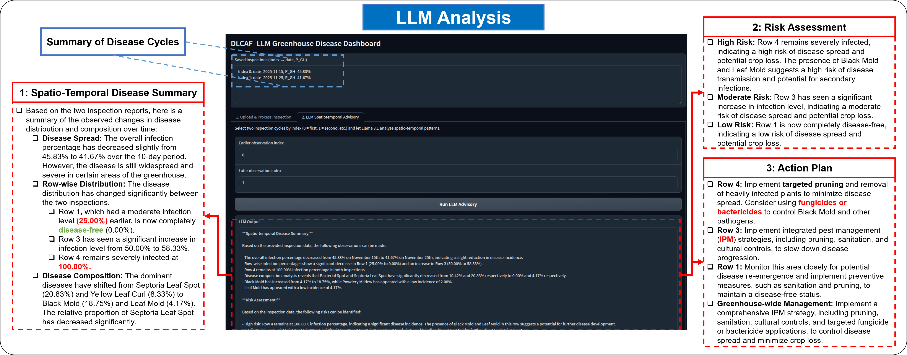

# DLCAF-LLM  
**An End-to-End Vision–Language and LLM-Driven Framework for Decision-Oriented Tomato Leaf Disease Management**

---

## 🔍 Overview

We propose an end-to-end framework that integrates **vision–language disease recognition**, **spatial aggregation**, and **large language model (LLM)–based reasoning** to support informed and actionable decision-making in greenhouse environments.

The pipeline processes tomato leaf images collected across multiple inspection cycles (e.g., at times \(t_0\) and \(t_n\)), capturing the evolving health status of the crop. Each image is processed by the proposed **Dual-Level Contrastive Alignment Framework (DLCAF)**, which combines:

- **Global disease description alignment**  
- **Local symptom consistency learning**

to produce **leaf-level disease predictions**. These predictions are then mapped to their corresponding greenhouse rows and categorized as healthy or infected, enabling downstream **spatiotemporal analysis and decision support** via an LLM-driven module.

---

## 📦 Checkpoint Release

We release a pretrained model checkpoint for evaluation and visualization.

- **Checkpoint file:** `best_model.pt`
- **Download:** [Checkpoints](https://drive.google.com/drive/folders/1ecYL3NXWpOYbZ-OdvgMwo07ls20P28Ef?usp=drive_link)
- The dataset can be downloaded from [Dataset](https://drive.google.com/drive/folders/1ecYL3NXWpOYbZ-OdvgMwo07ls20P28Ef?usp=drive_link)
- **Expected location:**

```bash
ckpt/best_model.pt
````

Make sure the `ckpts` folder exists and place `best_model.pt` inside it.

---

## ⚙️ Environment Setup

We recommend using a virtual environment.

```bash
python -m venv dlcaf_env
source dlcaf_env/bin/activate  # Linux / macOS
# dlcaf_env\Scripts\activate   # Windows

pip install -r requirements.txt
```

> **Note:** Python 3.8+ is recommended.

GPU is recommended for faster training and evaluation, but small-scale experiments may run on CPU depending on your setup.

---

## 📁 Recommended Repository Structure

A typical layout for this repository:

```bash
DLCAF-LLM/
├── ckpts/
│   └── best_model.pt
├── Dataset/
│   └── FullImages/
│       ├── Class1/
│       ├── Class2/
│       └── ... ClassN/
├── Eval/
│   └── Dataset1/
│       ├── Class1/
│       ├── Class2/
│       └── ... ClassN/
├── Dashboard/
│   ├── dashboard.py
│   └── ... (observation cycle folders, configs, etc.)
├── train.py
├── evaluation.py
├── requirements.txt
└── README.md
```

Adjust paths above if your structure differs, but keep them consistent with the training, evaluation, and dashboard scripts.

---

## 🏋️‍♂️ Training

For training, images should be organized as:

```bash
Dataset/
└── FullImages/
    ├── Class1/
    ├── Class2/
    ├── ...
    └── ClassN/
```

Each `ClassX` folder corresponds to a disease/health class.

Run:

```bash
python train.py
```

This will train DLCAF using the images in `Dataset/FullImages/`.

---

## 🧪 Evaluation

For evaluation/testing, organize the images as:

```bash
Eval/
└── Dataset1/
    ├── Class1/
    ├── Class2/
    ├── ...
    └── ClassN/
```

Once the checkpoint is placed at `ckpts/best_model.pt`, run:

```bash
python evaluation.py
```

This script will:

* Load the pretrained model from `ckpts/best_model.pt`
* Evaluate performance on the dataset organized under `Eval/`

---

## 📊 Dashboard & LLM-Driven Spatiotemporal Analysis

The repository includes an interactive dashboard to:

* Ingest images according to greenhouse layout and inspection cycles
* Run DLCAF for leaf-level disease recognition
* Aggregate predictions into plant- and row-level health maps
* Store spatial descriptors for later temporal comparison
* Generate **LLM-based advisory reports** for decision support

### 1️⃣ Preparing Observation Cycles

Inside the `Dashboard` folder, create or follow the predefined observation cycle folders. For example:

```bash
Dashboard/
├── dashboard.py
├── Cycle_t0/
└── Cycle_tn/
```

> The exact names (e.g., `Cycle_t0`, `Cycle_tn`) and structure should follow what is configured inside the `Dashboard` code. Place the corresponding inspection images for each observation cycle in these folders.

### 2️⃣ Launching the Dashboard

From the repository root:

```bash
cd Dashboard
python Dahsboard/dashboard.py
```

The dashboard will:

1. Allow you to **select or upload images** from the configured observation cycle folders
2. Use `ckpt/best_model.pt` to perform **leaf-level disease recognition**
3. Aggregate results into **spatial health maps** across rows and plants
4. Perform **spatiotemporal comparison** between inspection cycles
5. Generate an **LLM-driven advisory report** including:

   * Spatiotemporal disease summary
   * Risk assessment
   * Targeted action plan / recommendations

---

### GUI Overview



*Overview of the interactive GUI developed for the DLCAF+LLM framework. The interface supports structured image ingestion based on greenhouse layout, executes DLCAF for leaf-level disease recognition, aggregates predictions into plant- and row-level health maps, and stores spatial descriptors for subsequent temporal analysis.*

### LLM-Driven Spatiotemporal Analysis



*Example of the LLM-driven spatiotemporal analysis module within the GUI. The system retrieves stored inspection summaries, compares selected inspection cycles, and generates an interpretable advisory comprising a spatiotemporal disease summary, risk assessment, and targeted action plan.*
```

## 📚 Citation

Citation information will be updated upon paper acceptance.


```
